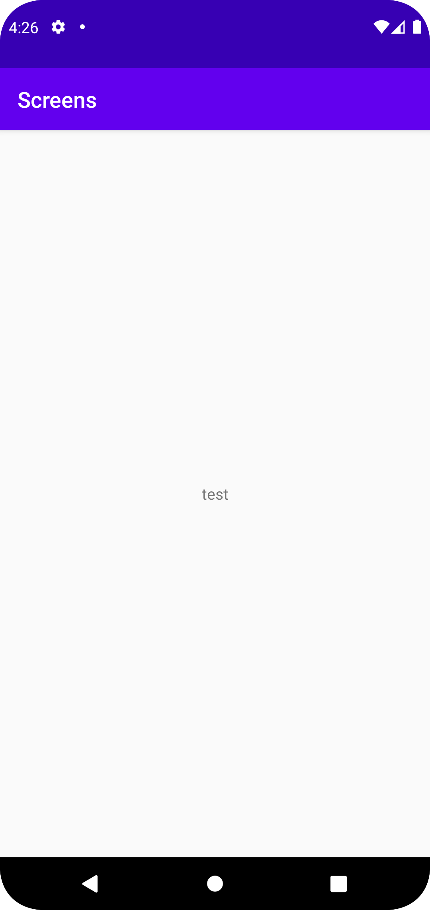

# Rapport

En activity vid namnet av SecondActivity skapades.
La till en knapp i MainActivity och gav den funktionaliteten att kunna byta till SecondActivity.
La till en string till intent bundlen med putExtra().
```
public void onClick(View v) {
Intent intent = new Intent(MainActivity.this, SecondActivity.class);
intent.putExtra("1", "test");
startActivity(intent);
}
```
Skapade en textview i SecondActivity som hämtade datan från intent.

